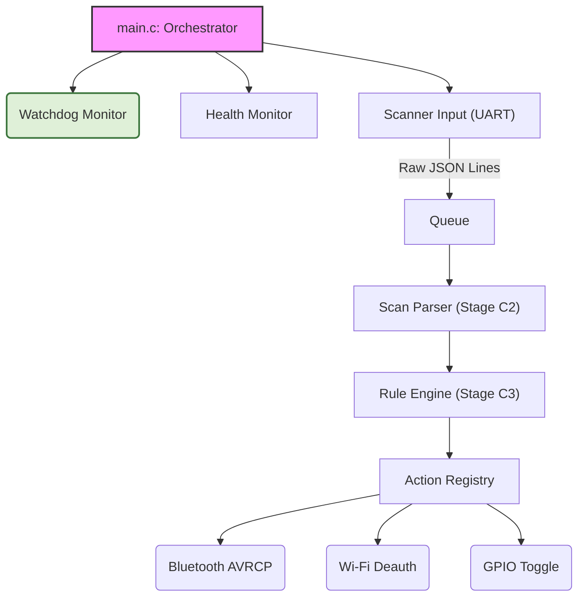

# ⚡ RF System Commander – The Headless, Modular RF Command Center for ESP32

**Stop building monolithic, fragile RF tools.** This firmware is a universal, headless command center for the ESP32. It listens to a modular scanner, evaluates user-defined rules, and triggers real-world actions—from Bluetooth AVRCP commands to Wi-Fi deauth attacks—all without a screen. Built with a plugin architecture and rigorous testing from the ground up.

[](#)
[](#) <!-- Replace with your license later -->
[](https://github.com/espressif/esp-idf)

---

## 🎯 What is this?

This is the **brain** of a distributed RF security system. One ESP32 acts as the *Scanner* (the eyes and ears, sniffing Wi-Fi, BLE, and Bluetooth Classic). This firmware runs on a second ESP32, the *Commander*, which **receives, decides, and acts**. It's built to be a universal framework, not a single-purpose gadget.

*   **🔌 Pluggable Architecture**: Add new scan modules (Wi-Fi, BLE, RFID...) or action modules (Bluetooth AVRCP, Wi-Fi deauth, GPIO toggle...) as simple, independent files without touching the core logic.
*   **🧠 Rule Engine Ready**: The framework is being built to evaluate rules like "if a BLE device named 'JBL Flip' is found, connect and press Play."
*   **🤖 100% Headless**: No screen, no buttons. Interact via serial commands and JSON output, perfect for integration with a phone, laptop, or another ESP32.
*   **🛡️ Bulletproof from Day 0**: Framework-first, dummy-module testing, a dedicated watchdog monitor, and memory safety checks prevent hidden bugs from ever taking root.

---

## 🏗️ Architecture at a Glance

The commander is built on a set of independent, reusable components.



The **Scanner** (a separate ESP32) sends JSON lines over UART. The **Commander** receives them, parses the data, and uses its rule engine to decide what to do.

---

## 🚦 Current Status: Stage C1 Complete

After a meticulous bring-up, the foundation is solid. The system boots cleanly, runs a stable health monitor, and has a hardened UART receiver ready for real data.

```json
{"source":"commander","device_id":"cmd_001","uptime_ms":66,"msg":{"type":"boot","status":"ready"}}
```

Check the serial output: health reports every 30 seconds, a dedicated watchdog keeping things safe, and a live UART channel waiting for scanner JSON. No resets, no memory leaks. **Ready to accept data.**

---

## ⚡ Quickstart

You'll need **ESP-IDF v6.1 (or v6.x)** installed.

```bash
# Clone the repo
git clone git@github.com:SS-Sauron/rf-system-commander.git
cd rf-system-commander/commander

# Build & Flash the Commander
idf.py set-target esp32
idf.py build flash monitor
```

You'll see the boot sequence in your terminal. Connect a USB-to-UART adapter to GPIO16 (TX) to simulate a scanner, and send a JSON line like `{"test":1}`. You'll see the commander echo it back.

---

## 📂 Project Structure

```
rf_system/
├── common_components/          # Shared, reusable firmware modules
│   ├── health/                 # Periodic heap & stack reporting
│   ├── output/                 # Thread-safe JSON line writer
│   ├── watchdog/               # Dedicated heartbeat monitor (Task Monitor Pattern)
│   └── scan_receiver/          # Hardened UART driver for scanner data
└── commander/                  # The Commander firmware project
    └── main/                   # Orchestrator and business logic
    │   ├── main.c
    │   ├── board_config.h      # All hardware pin assignments
    │   ├── Kconfig.projbuild   # Project configuration options
    └── sdkconfig.defaults      # Stability-oriented build defaults
```

---

## 🗺️ Development Roadmap

This is a living project. Every stage is tested independently before moving on.

*   **Stage C0**: ✅ Project skeleton, health monitor, output channel, watchdog.
*   **Stage C1**: ✅ Hardened UART receiver for scanner JSON lines.
*   **Stage C2**: 🚧 Scan Data Parser (extract `module` & `data` from JSON).
*   **Stage C3**: 🧠 Rule Engine & Rule Storage in NVS.
*   **Stage C4**: 🕹️ Action Module Interface & Dummy Action.
*   **Stage C5**: 👨‍💻 Local Command Parser for real-time control.
*   **Stage C6**: 🎵 Real Bluetooth AVRCP Action Module (play/pause/volume).
*   **Stage C7**: ⚔️ Additional Action Modules & Production Hardening.

See the [full project audit](https://github.com/SS-Sauron/rf-system-commander/blob/main/docs/audit) for a deep dive into the current codebase health.

---

## 🤝 Contributing

This project is just getting started, and the vision is big. Whether you're into low-level RF, Bluetooth hacking, or building clean embedded architectures, there's a place for you.

*   **Found a bug?** Open an issue.
*   **Want to add a scan or action module?** Fork the repo and submit a PR.
*   **Just want to discuss ideas?** Start a GitHub Discussion.

Let's build the most flexible, hackable, and robust ESP32 command center together.

**Created with relentless attention to detail by [SS-Sauron](https://github.com/SS-Sauron).** If you think this project is cool, give it a star! ⭐
